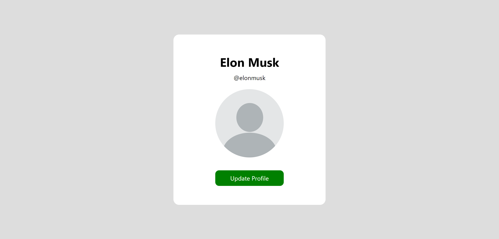

# Upload Image with Javascript
---
Simple layout before you select the image you want to upload



After selection of image from the local storage


Javascript code to user

```javascript
let profilePic = document.getElementById("profile");
        let uploadPic = document.getElementById("upload");

        uploadPic.onchange = function(){
            profilePic.src = URL.createObjectURL(uploadPic.files[0])
        }